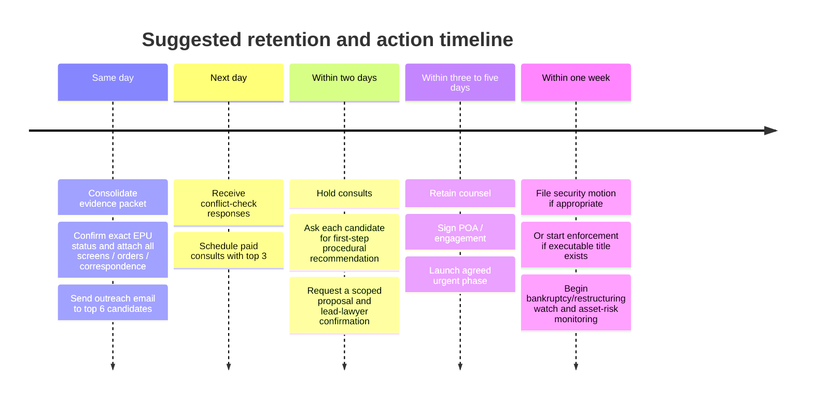

# Lawyer Search Report for a Polish Creditor Recovery and Asset Preservation Matter

## Executive summary

The attached brief describes a **creditor-side commercial recovery matter in Poland** against **Mateusz Szklarski-Łopata, trading as GPUcomputer, a sole proprietorship based in Kraków**, with an **original claim value of PLN 155,000** and a stated concern that the debtor may dissipate assets or use insolvency or restructuring procedures to frustrate payment. The brief also references an **EPU-style case number, “Nc-e 552126/26,”** and asks for counsel who can combine **commercial litigation, interim relief/security, enforcement, and creditor-side insolvency/restructuring work**, ideally with **English-language capability** and the ability to move quickly. fileciteturn0file0

On the public sources reviewed, the **strongest exact-fit candidates** for this fact pattern are **Karol Tatara / Tatara & Partners**, **Bartosz Groele / Groele i Wspólnicy**, and **Piotr Zimmerman / Zimmerman Sierakowski Frosztęga**. Tatara is the best **Kraków-based specialist** for creditor-side restructuring/bankruptcy strategy and cross-border communication; Groele is especially compelling where the matter may require a blend of **insolvency, litigation, and creditor-protection tools** such as challenging asset-shielding behavior; Zimmerman is the strongest **national specialist** if you want the deepest insolvency-and-enforcement bench even though the office is in Warsaw rather than Kraków. citeturn29search3turn36search0turn3search7turn44view0turn21search10turn40search4turn40search9

The immediate practical issue is **not choosing between litigation and insolvency in the abstract**, but determining which procedural lever is available **right now**. If the EPU matter has already produced an enforceable order and clause, counsel should move immediately to **execution planning and asset tracing**; if not, the most time-sensitive work is likely an urgent **motion to secure the claim**, paired with **local court strategy in Kraków** and continuous **restructuring/bankruptcy monitoring**. The official EPU materials confirm that Poland’s national electronic order-for-payment system is centralized in **Lublin**, while materials from the **Sąd Rejonowy dla Krakowa-Śródmieścia w Krakowie** support Kraków-Śródmieście as the likely local court structure for the debtor address on **Mogilska** and show that the same court includes a dedicated **VIII insolvency/restructuring division**. fileciteturn0file0 citeturn47search0turn47search3turn47search6turn10view0turn9view0turn7search1turn8search4

A final note on transparency: public sources were strong on **practice focus, rankings, bar status, and contact details**, but much weaker on **public fee schedules** and, for some lawyers, on **admission year precision**. Where exact public data were not available, this report says so directly rather than guessing. 

## Extracted case profile

### Key facts extracted from the attached brief

The brief identifies the claimant as a **creditor** seeking counsel for an urgent Polish collection and asset-preservation dispute. It names the opposing party as **Mateusz Szklarski-Łopata / GPUcomputer**, describes the debtor as a **sole proprietorship**, places the debtor in **Kraków at ul. Mogilska 16/7**, and states that the **original claim value is PLN 155,000**, likely now higher after accruals. It also states that the legal concern is an **immediate need to preserve assets and prevent the debtor from using formal insolvency or other maneuvers to evade payment**. fileciteturn0file0

The brief also says there is an **existing EPU/e-court matter** identified as **“Nc-e 552126/26”** and frames the tactical question as choosing among or coordinating **a motion to secure the claim, attachment, anti-fraud remedies, bankruptcy/restructuring watch, coordination with bailiffs, and lawsuit strategy**. It further specifies the desired profile of counsel: **Polish lawyer or small firm in Kraków or elsewhere in Poland** with strong **litigation, insolvency/restructuring, interim relief, creditor-side asset preservation, and English** capability. fileciteturn0file0

### Unspecified items that matter before retaining counsel

The brief does **not** clearly specify the **legal basis of the claim** such as invoice debt, contract breach, loan, supply agreement, tort, or unjust enrichment. It also does not specify the **date the debt arose**, when it became **due**, whether there is a **written contract**, whether the debtor has **admitted the debt**, or what documentary package currently exists. fileciteturn0file0

It is also unclear whether the EPU matter is merely **filed**, whether an **electronic order for payment has already issued**, whether any **opposition was filed**, or whether the claimant already has an **electronic enforceability clause**. That single unknown changes the first move materially: it determines whether counsel should prioritize **execution** or instead seek **security/interim relief while litigating the merits**. fileciteturn0file0 citeturn47search3turn47search6turn47search12turn47search18

Other missing items include whether there is known evidence of **asset transfers**, which **assets** are worth targeting, whether any **related entities** are involved, whether there is already a **bailiff file**, whether the debtor has signaled a coming **restructuring or bankruptcy filing**, and whether the current amount due includes **interest, costs, and enforcement expenses**. All of these should be gathered before or during the first consultation. fileciteturn0file0

## Jurisdiction and legal framing

### Relevant jurisdictions likely implicated by the brief

The brief’s reference to **“Nc-e”** fits the nomenclature of Poland’s **electronic order-for-payment system**, and official court information explains that EPU matters are handled centrally by the national e-court in **Lublin** rather than by the debtor’s local court. Official guidance also confirms that EPU orders and their enforceability clauses exist **electronically** within the e-court system. fileciteturn0file0 citeturn47search0turn47search3turn47search6turn47search11turn47search15

For local proceedings, the debtor’s address on **ul. Mogilska** points strongly toward **Kraków** and, more specifically, publicly available territorial materials from the **Sąd Rejonowy dla Krakowa-Śródmieścia w Krakowie** list **Mogilska** among streets associated with that court’s territorial coverage. The same court’s public structure shows **commercial divisions** and an **VIII Wydział Gospodarczy dla spraw upadłościowo-restrukturyzacyjnych**, which is important if local insolvency or restructuring steps become necessary. Because the available street list is published for a criminal division rather than civil/commercial allocation, I treat Kraków-Śródmieście as the **most likely local forum structure**, not as a definitive civil allocation without file-level confirmation. citeturn10view0turn9view0turn7search1turn8search4

### Practice areas actually needed for this matter

The brief is best understood not as “general debt collection” but as a hybrid of **commercial litigation**, **interim relief/security**, **enforcement/asset recovery**, and **creditor-side insolvency/restructuring**. Those are the practice areas that matter because the claimant is worried not just about winning on paper, but about **preventing the debtor from becoming judgment-proof**. fileciteturn0file0

That means the right lawyer should be able to do four things in parallel. First, verify the exact status of the **EPU matter** and the fastest route to an enforceable title if one does not already exist. Second, assess whether a **security motion** or comparable asset-preservation step can and should be filed immediately. Third, monitor or respond to any **restructuring/bankruptcy filing** and represent the creditor in that forum if needed. Fourth, evaluate whether the factual record supports more aggressive **creditor-protection remedies** if there is evidence of asset shielding or suspect transfers. fileciteturn0file0

Because the debtor is described as a **sole proprietorship**, classic **board-liability** remedies are not the main line against the named debtor itself. They may still matter if there are **related entities or successor structures**, but the core short-listing criterion should remain **creditor-side litigation + security + insolvency familiarity**, not generic company-law advisory work. This is an inference from the brief’s identification of the debtor as a sole trader. fileciteturn0file0

## Candidate comparison

The table below is a fast comparison view. The detailed dossiers that follow provide the full field-by-field information requested.

| Candidate | Base | Exact-fit strengths | English signal | Public quality signals | Main caveat |
| --- | --- | --- | --- | --- | --- |
| **Karol Tatara / Tatara & Partners** | Kraków | Creditors, bankruptcy, restructuring, pre-pack, distressed assets, board-liability spillover | Strong firm-level English/German capability | Chambers-ranked; Legal 500 profile; long Rzeczpospolita recognition | Public fee schedule not posted |
| **Bartosz Groele / Groele i Wspólnicy** | Kraków | Insolvency, restructuring, litigation, creditor-rights policy work, actio-pauliana-type orientation | English-language public materials; individual language not expressly listed in reviewed bio | Section chair at Kraków bar; government and UNCITRAL roles | Less independent review/ranking data than Tatara/Zimmerman |
| **Piotr Zimmerman / Zimmerman Sierakowski Frosztęga** | Warsaw | National insolvency leader; creditors and distressed-asset recovery; enforcement expertise | English-language site and materials | Strong Legal 500/Rzeczpospolita profile; specialist-only positioning | Not Kraków-based |
| **Wojciech Kremer / Kremer Legal** | Kraków | Litigation, creditors in bankruptcy/restructuring, committees, enforcement, English-friendly solo practice | Explicitly fluent in English | Clear public practice statement; official OIRP Kraków listing | No major international ranking signal located |
| **Piotr Proniewski / Proniewski Przybyłka** | Kraków | Commercial disputes, business law, restructuring/bankruptcy support, creditor security concepts | Language capability not clearly stated on reviewed bio | Official adwokat registry and robust local business practice | Less insolvency-specialist depth than Tatara/Groele/Zimmerman |
| **Karol Stelmaszczuk / KS Legal** | Kraków | Litigation/arbitration, restructuring/insolvency offering, fee-model flexibility, same-area logistics | Firm FAQ says Polish and English | Official adwokat registry plus public billing-model disclosure | Public site quality is mixed; same-building proximity to debtor warrants explicit conflict check |

The ranking logic in this comparison is grounded in the reviewed public sources, especially official/primary materials from the candidate firms and Kraków legal institutions, then supplemented by Chambers, Legal 500, and the national adwokat registry where available. citeturn36search0turn29search3turn44view0turn21search10turn40search4turn40search9turn22search3turn23search0turn46view0turn19view0turn33view0

## Detailed shortlist

**Karol Tatara**

| Field | Details |
| --- | --- |
| Name | Karol Tatara |
| Firm | Tatara & Partners Restructuring & Insolvency Law Firm |
| Location | Kraków office: ul. Filipa Eisenberga 11/1, 31-523 Kraków |
| Bar admission year(s) | **Not publicly located** in the reviewed sources; OIRP Kraków listing confirms **KR-1730** |
| Languages | Firm-level service in **Polish, English, German**; Paweł Kuglarz leads the International Desk and is fluent in **English and German** |
| Practice focus | Restructuring, bankruptcy, pre-pack, distressed assets, analyses/opinions, board-liability matters, support to insolvency courts |
| Representative experience | Advised in the **first prepared liquidation (pre-pack) in Poland**; participates in all major restructuring tracks available after 2016; advises participants in restructuring and bankruptcy proceedings, including **creditors** |
| Relevant case outcomes or publications | Karol Tatara’s bio highlights the first Polish pre-pack and broad restructuring experience; the firm also published on **European actio Pauliana** issues for **The Legal 500** and authored Chambers’s **Insolvency 2025 Poland** trends piece |
| Client-review summary | Strongest public reputation signals are **Chambers** and **Legal 500** recognition rather than consumer-style review websites; no meaningful independent star-rating corpus was located in the reviewed sources |
| Contact info | +48 12 634 52 92; kancelaria@tatara.com.pl |
| Estimated fee structure | **Public fee schedule not posted.** Expect a bespoke proposal; likely fixed-fee urgent workstream plus hourly follow-on. Use the brief’s benchmark of **PLN 8k–25k + VAT initial** and **PLN 500–1,500/hour senior time** when requesting proposals |
| Why this case fits | Best **Kraków-specialist** match for a creditor worried about asset dissipation, insolvency tactics, and fast procedural escalation |
| Sources | citeturn36search0turn36search1turn4search11turn35search1turn35search5turn3search7turn29search3turn3search13turn34search1 |

Tatara is the most surgically aligned option because the firm publicly states that it supports **debtors, investors, creditors, and insolvency courts**, has **Kraków-based infrastructure**, and has deep experience in **pre-pack**, **restructuring proceedings**, and **distressed assets**. For an English-speaking creditor who wants the strongest niche bench in the relevant city, this is the cleanest first call. citeturn4search11turn35search5turn29search3turn36search0turn3search13

**Bartosz Groele**

| Field | Details |
| --- | --- |
| Name | Bartosz Groele |
| Firm | Groele i Wspólnicy sp.k. |
| Location | ul. Kielecka 2, 31-526 Kraków |
| Bar admission year(s) | **2013**; adwokat at the District Bar Council in Cracow |
| Languages | English-language public materials available; **individual language ability not expressly listed** on the reviewed profile |
| Practice focus | Insolvency and reorganization law, litigation, contract law, business law |
| Representative experience | Public materials note consultancy work for the **World Bank** on insolvency and creditor-rights protections, participation in **UNCITRAL Working Group V**, and a reported matter in which the firm represented the **main creditor of PGE Polska Grupa Energetyczna S.A.** in sanation proceedings |
| Relevant case outcomes or publications | Bartosz Groele’s publications include work on how **security interests affect dismissal of bankruptcy petitions**, commentary on developers’ insolvency, and a piece asking whether a **mortgage remains a sure way of securing receivables** |
| Client-review summary | I did **not** locate a meaningful independent client-review corpus in the reviewed public sources; the strongest public signals are leadership roles, publications, and legislative/international appointments |
| Contact info | +48 12 631 07 90; +48 12 633 15 98; kancelaria@groele.net.pl |
| Estimated fee structure | **Public fee schedule not posted.** Expect bespoke pricing; the likely structure is fixed-fee urgent pleadings plus hourly strategy/follow-on litigation |
| Why this case fits | Particularly attractive where the matter may need a combination of **insolvency know-how, litigation skill, and creditor-protection strategy** rather than only routine debt collection |
| Sources | citeturn44view0turn13search1turn13search0turn13search3turn21search10turn21search7turn45view0 |

Groele stands out because his public profile is unusually rich on **creditor-rights architecture**, **insolvency reform work**, and **courtroom capability**. If the facts later suggest asset diversion, anti-fraud theories, or the need to navigate around a tactical restructuring filing, he is one of the more intellectually and procedurally interesting Kraków options on the list. citeturn44view0turn13search1turn21search10turn21search7

**Wojciech Kremer**

| Field | Details |
| --- | --- |
| Name | Wojciech Kremer |
| Firm | Wojciech Kremer Kancelaria Radcy Prawnego |
| Location | ul. Armii Krajowej 18, Galileo, 10th floor, 30-150 Kraków |
| Bar admission year(s) | **Not publicly located** in the reviewed sources; OIRP Kraków listing confirms **KR-4222** |
| Languages | **Fluent in English** |
| Practice focus | Civil law, company law, bankruptcy and restructuring law, litigation, ADR, business contracts, liability of board members and corporate disputes |
| Representative experience | Public practice page states representation of **creditors** in bankruptcy and restructuring proceedings, including filing claims, monitoring proceedings, participating in creditors’ committees and meetings, and coordinating enforcement/recovery work |
| Relevant case outcomes or publications | Published pieces include **Time limit for filing a petition for bankruptcy** and **Actio pro socio**, both relevant to distressed business disputes and procedural strategy |
| Client-review summary | No meaningful independent review corpus was located during this search; public value lies more in clearly described practice scope, English fluency, and a smaller-practice service model |
| Contact info | +48 791 871 157; biuro@kremerlegal.pl; w.kremer@kremerlegal.pl |
| Estimated fee structure | **Public fee schedule not posted.** Likely custom quote; smaller-practice format may make it easier to negotiate a narrow, urgent mandate |
| Why this case fits | Strong **mid-boutique Kraków option** if you want direct access to a lawyer who expressly handles **creditor representation** in bankruptcy/restructuring and also litigates |
| Sources | citeturn22search3turn22search4turn22search8turn22search0turn22search6turn23search0 |

Kremer is not as publicly decorated as Tatara or Zimmerman, but the fit is still real: the site expressly mentions **representing creditors**, **filing claims**, **creditors’ committees**, and **recovery/enforcement of claims**, all while confirming **English fluency** and a Kraków base. For a practical, responsive, less institutional-feeling engagement, this is a credible candidate. citeturn22search3turn22search4turn22search8turn22search0

**Piotr Proniewski**

| Field | Details |
| --- | --- |
| Name | Piotr Proniewski |
| Firm | Kancelaria Adwokacka Proniewski Przybyłka |
| Location | ul. Konopnickiej 5/4, 30-302 Kraków |
| Bar admission year(s) | Official national adwokat register shows **2009-03-23** in the current chamber; firm bio says member of the Kraków Bar since **2010** |
| Languages | **Not clearly stated** in the reviewed public bio |
| Practice focus | Business law, commercial disputes, company law, tax, intellectual property; firm also offers **restructuring and insolvency** support |
| Representative experience | The firm publicly advertises support for entrepreneurs in **restructuring and liquidity problems**, **representation of creditors**, ongoing company support, and advice on **security tools** such as mortgage, pledge, bill of exchange, and notarial submission to enforcement |
| Relevant case outcomes or publications | Firm articles and practice pages cover **restructuring and bankruptcy law**, **rejestr dłużników niewypłacalnych**, and commercial-risk structuring for businesses |
| Client-review summary | No meaningful independent client-review corpus was found in the reviewed sources; the public signal here is a long-running local business practice with a broad commercial bench |
| Contact info | Office: (+48) 12 345 56 94; mobile: 509 153 595; piotr.proniewski@ppsc.pl; kancelaria@ppsc.pl |
| Estimated fee structure | The firm’s restructuring page says ongoing service is commonly priced on a **retainer, hourly, or mixed** basis; ask whether a narrow urgent mandate can be quoted as a fixed fee |
| Why this case fits | Good **business-litigation-forward** Kraków candidate if the dispute is factually commercial and may require both merits work and some restructuring awareness, even if the firm is not as niche-insolvency-heavy as Tatara or Zimmerman |
| Sources | citeturn19view0turn46view0turn16search0turn16search1turn17search0turn17search8turn20search0 |

Proniewski Przybyłka becomes more attractive if, after review of the evidence packet, the case looks like a **straight commercial claim with urgent security and enforcement overlays** rather than a full-blown insolvency chess match. It is the most obviously **commercial-enterprise-oriented** Kraków option on this list after the pure insolvency boutiques. citeturn46view0turn16search0turn16search1turn17search0

**Karol Stelmaszczuk**

| Field | Details |
| --- | --- |
| Name | Karol Stelmaszczuk |
| Firm | Kancelaria KS Legal |
| Location | ul. Mogilska 16/10, 31-516 Kraków |
| Bar admission year(s) | **2014-05-07**; KRA/Adw/3020 |
| Languages | Firm FAQ says work is performed in **Polish and English** |
| Practice focus | Corporate restructuring and insolvency, litigation & arbitration, civil law, commercial contracts, company law, white-collar/criminal work |
| Representative experience | Public materials say the firm has concluded **hundreds of commercial and criminal proceedings**, provides ongoing legal counsel to companies, and offers restructuring/insolvency support across Poland |
| Relevant case outcomes or publications | Public site highlights restructuring and insolvency services and blog/public commentary on civil/commercial topics, but I did not locate a strong insolvency publication trail comparable to Tatara or Groele |
| Client-review summary | The website displays several **5-star testimonials**, but they are **self-published and not independently verified** |
| Contact info | +48 690 615 183; sekretariat@kancelariakslegal.pl |
| Estimated fee structure | Public FAQ says the firm uses **hourly**, **monthly retainer**, and **success-fee** models; for this matter, ask whether they can give a fixed fee for an urgent first-phase filing set |
| Why this case fits | Useful if you value **speed, bilingual access, and fee-model flexibility**; the office’s **Mogilska** location may also help with on-the-ground logistics |
| Sources | citeturn33view0turn15search1turn14search0 |

KS Legal is a pragmatic rather than prestige-driven option. Two points make it interesting: it is one of the few reviewed firms that publicly states its **billing models**, and it is located at **Mogilska 16/10**, extremely close to the debtor address identified in the brief. That proximity is operationally useful, but because it is the same building complex, you should ask for an explicit **conflict screen** before discussing sensitive strategy. fileciteturn0file0 citeturn33view0turn15search1turn14search0

**Piotr Zimmerman**

| Field | Details |
| --- | --- |
| Name | Piotr Zimmerman |
| Firm | Zimmerman Sierakowski Frosztęga Kancelaria Radców Prawnych i Adwokatów |
| Location | Aleje Jerozolimskie 81, 02-001 Warszawa |
| Bar admission year(s) | **Not publicly located** in the reviewed sources; public bio shows judicial career from **1997–2006** before later practice as a legal adviser and restructuring specialist |
| Languages | Firm operates a full **English-language site** and English-language publications; the reviewed personal bio does **not separately list languages** |
| Practice focus | Bankruptcy law, restructuring, enforcement proceedings, commercial/company law, disputes, support for receivers and creditors |
| Representative experience | The firm describes itself as the **first law firm in Poland fully specialised in bankruptcy law**, states it represents **creditors and debtors**, and Legal 500 notes experience with **recovery actions involving distressed assets**; Piotr Zimmerman’s public bio highlights prior bankruptcy-court judicial experience |
| Relevant case outcomes or publications | Piotr Zimmerman is a prolific author and commentator in restructuring/bankruptcy; public materials highlight repeated leadership in **Rzeczpospolita** rankings and longstanding recognition in insolvency rankings |
| Client-review summary | Strongest public reputation signal on this list besides Tatara: **Legal 500** praises the team’s “reliability, availability, and deep understanding of restructuring law” |
| Contact info | +48 22 46 81 211; sekretariat@zimmerman.com.pl |
| Estimated fee structure | **Public fee schedule not posted.** Given national-market positioning and rankings, expect premium bespoke pricing |
| Why this case fits | Best **non-Kraków, no-budget-cap** option if you want Poland’s most established insolvency-and-enforcement boutique rather than a purely local shop |
| Sources | citeturn40search4turn40search3turn40search9turn40search11turn42search0turn42search7 |

Zimmerman is the best “bring in the heavy national specialist” option. It loses points only on geography. If the matter turns into a sophisticated fight over **EPU posture, enforcement, distressed-asset recovery, or insolvency forum tactics**, that geography penalty may not matter much. citeturn40search4turn40search9turn40search11turn42search0

### Public conflict scan

I did **not** identify any public statement in the reviewed materials showing that the shortlisted candidates represent **GPUcomputer** or **Mateusz Szklarski-Łopata**. That said, public web review cannot replace a proper professional **conflicts check**, and every shortlisted office should be asked to confirm conflicts **before** you share confidential documents. The only concrete public issue worth flagging is KS Legal’s address at **Mogilska 16/10**, because the debtor address in the brief is **Mogilska 16/7**. fileciteturn0file0 citeturn33view0turn15search1

## Recommendations and next-step plan

### Recommended top three

**Tatara & Partners** is the best first outreach target. The advantages are unusually direct: **Kraków base, creditors-in-insolvency capability, cross-border/English capability, Chambers visibility, and demonstrated pre-pack/restructuring depth**. The main downside is that the firm is so niche and reputed that it may be comparatively expensive or may focus the strategy quickly toward insolvency architecture rather than the underlying commercial merits. citeturn4search11turn35search1turn29search3turn36search0turn3search13

**Groele i Wspólnicy** is the best “sharp creditor-protection strategist” option in Kraków. The upside is the blend of **insolvency, litigation, academic depth, legislative work, and creditor-rights orientation**. The downside is that there is less publicly visible third-party ranking/testimonial material than for Tatara or Zimmerman, and the reviewed bio did not explicitly list Bartosz Groele’s languages even though the firm publishes English-language materials. citeturn44view0turn13search1turn21search10turn21search7turn45view0

**Zimmerman Sierakowski Frosztęga** is the best specialist if you want to optimize for **national-tier insolvency sophistication** rather than local proximity. The benefits are the firm’s market position, creditor/debtor experience, and strong public reputation signals. The drawbacks are the **Warsaw location** and the likelihood of **premium fees**. If your priority is instead a local Kraków engagement with clearer English support and direct creditor-practice statements, **Wojciech Kremer** is the most logical substitute for Zimmerman in a local-only top three. citeturn40search4turn40search9turn40search11turn22search3turn22search4turn22search8

### Outreach email template

```text
Subject: Urgent Kraków creditor matter — claim security / enforcement / insolvency-risk review

Dear [Lawyer/Firm Name],

I am seeking urgent Polish counsel for a creditor-side matter involving a Kraków sole proprietor.

Core points:
- Debtor: Mateusz Szklarski-Łopata, trading as GPUcomputer
- Debtor address: ul. Mogilska 16/7, 31-516 Kraków
- Original claim value: PLN 155,000, likely higher now with accruals
- Current concern: preserving assets and preventing dissipation or insolvency/restructuring tactics that could frustrate recovery
- Existing court reference: EPU / “Nc-e 552126/26” (please confirm exact procedural status and next best move)

I need counsel who can immediately assess:
- whether an urgent motion to secure the claim should be filed,
- whether enforcement steps are already available,
- whether any creditor-protection / anti-transfer tools should be considered,
- and how to monitor or respond to any restructuring or bankruptcy filing.

Please let me know:
- whether you can take this on immediately,
- whether you see any conflicts,
- who would lead the matter,
- your proposed first-step scope,
- and your fee structure for an urgent initial phase.

I can send the current document packet immediately.

Best regards,
[Your Name]
[Phone]
[Email]
```

This template is built directly around the facts and urgency the brief identifies, and it is designed to force quick screening on **conflicts, procedural posture, and first-step cost**. fileciteturn0file0

### Phone script

```text
Hello, my name is [Your Name]. I’m looking for urgent creditor-side counsel for a Kraków matter.

The debtor is a sole proprietor, Mateusz Szklarski-Łopata / GPUcomputer, based on Mogilska in Kraków. The original claim is PLN 155,000 and I’m concerned about asset dissipation and possible insolvency or restructuring tactics.

There is also an EPU-style reference, “Nc-e 552126/26,” and I need a lawyer who can quickly assess whether the best immediate step is:
1) securing the claim,
2) enforcement,
3) creditor-protection / anti-transfer action,
or
4) insolvency monitoring and response.

Can you please tell me:
- whether your firm handles this kind of creditor-side litigation plus insolvency overlap,
- whether you have any conflicts,
- who would lead the first review,
- and whether you can schedule a consultation in the next 24–48 hours?

I can email the documents as soon as you confirm the right contact person.
```

### Next-step timeline



If the debtor-obstruction risk is real, the timeline above should be compressed to **same-day outreach and 24-hour screening**, because the brief’s entire commercial problem is speed, not just legal correctness. fileciteturn0file0

### What to send counsel immediately

Send the brief, the exact **EPU screenshots or orders**, the underlying contract or invoices, demand letters, proof of service, all debtor identifiers you hold, any evidence of asset movements, and a one-page chronology. In this matter, the best lawyer will almost certainly be the one who can decide fastest whether the file already supports **execution**, requires **security**, or needs a dual-track approach with **insolvency surveillance**. fileciteturn0file0

### Bottom line

If you want the **strongest exact-fit Kraków specialist**, start with **Tatara & Partners**. If you want a **litigation-plus-creditor-protection thinker in Kraków**, start with **Groele i Wspólnicy**. If you want the **strongest national insolvency bench regardless of city**, include **Zimmerman Sierakowski Frosztęga** in the first round. A pragmatic parallel track would be to contact **Tatara, Groele, Kremer, and Zimmerman on the same day**, then choose after quick conflicts checks and first-step proposals. citeturn29search3turn44view0turn22search3turn40search4turn40search9