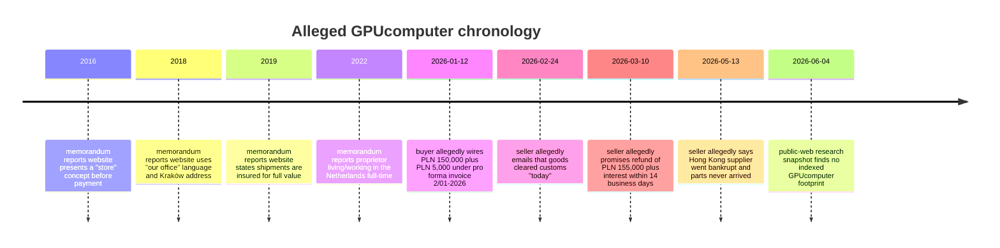

# GPUcomputer Fraud Research Memorandum

## Executive Summary

This report is a litigation-style research memorandum on alleged fraud involving GPUcomputer, prepared from the attached factual memorandum supplied in this session and from public-web research focused on primary and official sources where available. The attached memorandum is the foundation for all case-specific facts stated below. [Pasted markdown](sandbox:/mnt/data/Pasted%20markdown.md) fileciteturn0file0

On the present record, the strongest theory is **not** a generic “they took money and later failed to deliver” theory. Standing alone, non-delivery after prepayment can be characterized by the defense as breach of contract, supply-chain failure, or insolvency rather than criminal fraud. The stronger theory is a **pre-payment inducement** theory: that before payment, GPUcomputer allegedly used specific, factual, business-identity and logistics statements to induce payment, including statements implying a real operating “store” or office presence in Kraków and a concrete practice that shipments were “insured for full value.” If those statements were false when made, and if they were material to the buyer’s decision to pay, they are much more useful to a prosecutor or civil court than post-payment excuses alone. fileciteturn0file0 citeturn75view2turn78search0turn63news0

The attached memorandum also points to a potentially important identity and control issue: GPUcomputer appears to have been operated as a Polish sole-trader business rather than a separate corporation, which means the decisive public-record questions are likely CEIDG, NIP/VAT, and related registers, not KRS corporate filings. Public sources describe CEIDG as the central public register for natural-person businesses, and they note that a CEIDG sole trader is a natural person entrepreneur whose business name must include the entrepreneur’s first and surname. That matters because a complaint or statement of claim should likely target the natural person trader, not just the commercial style “GPUcomputer.” citeturn86search0turn88view0turn86search2

The open-web results are notable for what they **did not** show. Despite repeated targeted searches, I did not locate an indexed official GPUcomputer website domain, indexed terms of service, refund or warranty pages, press releases, mainstream news articles, indexed forum complaint threads, publicly indexed social-media footprint, or publicly indexed lawsuits/regulatory actions specifically naming GPUcomputer, Mateusz Szklarski, or Waldemar Łopata. That does **not** disprove the allegations; it means that the public indexed footprint appears thin, so the case will likely rise or fall on preserved first-party evidence: website captures, invoice and bank documents, original emails with headers, domain/email/hosting records, and proof regarding the Kraków address and shipping/insurance claims. citeturn15search0turn16search0turn53search0turn54search0turn55search0turn79search0turn80search0

My bottom-line assessment is this: **the fraud theory is plausible but still evidence-sensitive**. On the current record, the best criminal-facing formulation is “payment was induced by factual, pre-contract falsehoods about business reality and delivery/shipping assurances, not merely followed by later non-performance.” Civil claims for refund, breach of contract, and—depending on proof and transaction purpose—consumer-protection or deceit-style remedies appear stronger and less fragile than a criminal fraud theory. The criminal theory improves materially if you can prove four things: the exact pre-payment website content; authorship or control of that content; falsity at the time of payment; and direct causal significance to the transfer decision. fileciteturn0file0 citeturn75view2turn89view1turn75view3turn63news0

## Scope, Sources, and Verification Limits

The case-specific account here comes from the attached memorandum, which reports, among other things, a January 2026 payment of PLN 155,000 under a pro forma invoice, later contradictory communications about delivery and refund, and pre-payment website statements implying a real Kraków business presence and “full value” shipping insurance. Because the underlying bank confirmations, email exports, website captures, invoice PDF, and registry extracts were **described** in the memorandum rather than independently attached here, this report distinguishes carefully between facts **reported in the memorandum** and facts **independently verified from public sources**. [Pasted markdown](sandbox:/mnt/data/Pasted%20markdown.md) fileciteturn0file0

Public-source verification was strongest for the general legal framework and for the structure of Polish and EU registers and consumer-law duties. It was much weaker for GPUcomputer-specific public materials. CEIDG is described in public reference material as Poland’s central register for natural-person business activity, with publicly accessible data enjoying a form of public trust; public register summaries also explain that CEIDG covers sole traders and that such businesses use the entrepreneur’s natural-person identity rather than a separate corporate personality. citeturn88view0turn86search0turn86search2

By contrast, I could not independently retrieve an indexed GPUcomputer site, its terms, its press releases, or a public complaint trail naming the business. Repeated searches for official pages, complaints, reviews, lawsuits, social media, and regulator mentions returned no indexed results. That means the absence of open-web hits should be treated as a **research limitation**, not an exonerating fact. It also means preservation of the user’s own evidence is unusually important here. citeturn15search0turn16search0turn53search0turn54search0turn55search0turn79search0turn80search0

One more limitation matters legally: the attached memorandum cites a specific Polish Supreme Court decision, “III KK 216/25,” as support for a pre-contract misrepresentation theory. I was **not able to independently verify that citation in indexed public web sources during this pass**. I therefore do not rely on that case as a verified authority in this memorandum, even though the memo’s overall line of reasoning is directionally consistent with standard fraud analysis. fileciteturn0file0 citeturn20search0turn25search0

## Chronology and Evidence Map

The timeline below is a synthesis of the attached memorandum plus public-law context. At present, most event entries are **memorandum-sourced** and should be upgraded into exhibit-backed entries before filing. fileciteturn0file0

| Date | Event | Amount | Present evidence status | Source |
|---|---|---:|---|---|
| 2016 onward | Website allegedly used language indicating a “store” or retail presence rather than only a remote or mailing presence. | — | Reported in memorandum; needs archived snapshot or contemporaneous capture. | Memo fileciteturn0file0 |
| 2018 onward | Website allegedly used “our office” wording tied to a Kraków address. | — | Reported in memorandum; needs archived page, CEIDG extract, and address-use proof. | Memo fileciteturn0file0 |
| 2019 onward | Website allegedly stated that each shipment is carefully packed and “insured for full value.” | — | Reported in memorandum; needs archived page and shipping/insurance records. | Memo fileciteturn0file0 |
| 2022 onward | Proprietor allegedly lived and worked in the Netherlands full-time while GPUcomputer was presented as operating from Kraków. | — | Reported in memorandum; needs independent corroboration beyond profile screenshots. | Memo fileciteturn0file0 |
| 2026-01-12 | Buyer allegedly transferred PLN 150,000 and PLN 5,000 under pro forma invoice no. 2/01-2026. | 155,000 PLN | High-priority exhibit gap: need MT103/SWIFT, bank statement, invoice PDF. | Memo fileciteturn0file0 |
| 2026-02-24 | Seller allegedly stated by email that the goods had cleared customs that day. | — | Needs original `.eml` with full headers and any customs/tracking numbers. | Memo fileciteturn0file0 |
| 2026-03-10 | Seller allegedly promised in writing to refund PLN 155,000 plus interest within 14 business days. | 155,000 PLN + interest | Needs signed letter or original email; this is a strong admissions exhibit if authentic. | Memo fileciteturn0file0 |
| 2026-05-13 | Seller allegedly said the Hong Kong supplier had gone bankrupt and the parts never arrived. | — | Needs original email; important because it may conflict with prior “customs cleared” statement. | Memo fileciteturn0file0 |
| 2026-06-04 | Open-web review found no indexed GPUcomputer terms, press releases, complaints, lawsuits, or regulator mentions. | — | Independently verified only as a negative indexed-web finding. | Web citeturn15search0turn16search0turn53search0turn54search0turn55search0turn79search0turn80search0 |

The highest-value chronology move is to convert every “memorandum-sourced” entry into an exhibit-backed entry. In a fraud case, the single most important timestamp is the buyer’s decision point just before payment. You therefore want a clean evidentiary chain showing what the buyer saw, when the buyer saw it, what the seller promised in that moment, and what the seller knew then—not only what went wrong later. fileciteturn0file0 citeturn75view2turn89view1

## Public-Record and Open-Source Findings

The public-record structure points toward a **sole-trader** setup rather than a corporation. Public sources describe CEIDG as the Polish register for natural-person entrepreneurs and explain that CEIDG businesses are not KRS corporations; they are natural persons conducting business activity, and their name must include the person’s first and surname. If the attached memorandum is right that GPUcomputer was run through a CEIDG entry, the right official-record package is likely: CEIDG extract, NIP/REGON verification, VAT white-list status, and possibly tax/regulatory checks—not KRS shareholder or board records. citeturn86search0turn88view0turn86search2

That matters for pleading and for attribution. In a CEIDG-style natural-person business, the commercial style “GPUcomputer” is not the same thing as a separate legal entity. For civil recovery, it is usually more effective to identify the natural person entrepreneur by full legal name plus the trade style used in commerce. For criminal or prosecutorial framing, that structure also makes the questions of **who controlled the site, the inbox, the invoice, and the funds** more concrete. citeturn86search2turn88view0

The open-web search results did **not** reveal an independently indexed GPUcomputer official site or indexed policy pages. I also did not find indexed press releases, official complaint pages, mainstream news coverage, forum threads, or public dockets specifically naming GPUcomputer or the two individuals named in the memorandum. Again, that is only a statement about what is publicly indexed and reachable through ordinary web research. It does not tell you whether the business existed, whether the site used different branding, or whether public records can still be obtained directly from registries, hosts, banks, or service providers. citeturn15search0turn16search0turn53search0turn54search0turn55search0turn79search0turn80search0

The best public-law materials I did verify are the EU consumer-protection rules that Poland implements. The Consumer Rights Directive requires traders in distance contracts to provide pre-contract information, including the identity of the trader and the geographical address at which the trader is established, plus the address for complaints if different. The Directive also puts the burden of proof for compliance with those information duties on the trader. That is directly useful because it shows that trader identity and geographical address are not fluff in e-commerce law; they are legally recognized, pre-contract information points. citeturn74view0turn75view1turn75view2turn89view1

The same Directive also states that, absent an agreed delivery time, the trader must deliver without undue delay and not later than 30 days from conclusion of the contract, and that the consumer may terminate if the trader still fails to deliver after an appropriate additional period. It also says the risk of loss or damage passes to the consumer only when the consumer or a third party designated by the consumer acquires physical possession of the goods. Those rules are especially useful if the buyer qualifies as a consumer and the workstation was not bought primarily for business/professional use. citeturn75view3turn75view4turn75view1

Consumer-law enforcement practice also supports the materiality of delivery and availability representations. In 2024, Reuters reported that Poland’s UOKiK fined Amazon over allegedly misleading customers about product availability and delivery dates; the regulator stated that the average consumer is entitled to assume that purchase options, availability, and delivery times offered by traders are not misleading. That does not prove the GPUcomputer allegations, but it does show that Polish consumer law treats concrete delivery and availability representations as serious factual claims, not harmless sales talk. citeturn63news0

## Polish Legal Analysis

### Criminal fraud by pre-payment misrepresentation

The memorandum’s criminal theory is strongest if framed as **fraud at formation** rather than mere later breach. In practical terms, the alleged misrepresentations that matter most are the ones said to have existed **before the funds were sent**: the apparent representation of a real Kraków “store” or office/business presence, the representation of established shipping/insurance practice, and the broader implication that GPUcomputer was a real, functioning local business capable of building and shipping the promised workstation. If those statements were false when payment was induced, they are much more probative of fraudulent intent than post-payment delay alone. fileciteturn0file0 citeturn75view2turn89view1turn63news0

The “puffery” objection is weakest against the **store/address** and **full-value insurance** statements. General slogans like “top quality,” “built with passion,” or “premium service” can often be dismissed as non-actionable sales language. But a statement implying a real store or office at a specific address, or a statement that shipments are insured for full value, is different. They are concrete and verifiable. EU consumer law specifically treats trader identity, geographical address, and delivery information as core pre-contract terms, and Polish consumer-enforcement practice treats concrete availability/delivery statements as material. That makes the defense argument that these were just harmless marketing phrases materially weaker. citeturn75view1turn75view2turn89view1turn75view3turn63news0turn78search0

Of the three pre-payment misrepresentation themes in the memorandum, I would rank them this way on the current record. **Strongest:** the “store/office/business reality” theme, because trader identity and address are legally material and because that theory goes directly to whether a deceptive commercial front was used. **Second strongest:** the “insured for full value” theme, because it is specific and verifiable, especially if you can prove no shipment or no insurance existed. **Weakest standing alone but useful corroboratively:** the “owner lived abroad / business could not really operate from Kraków” theme, because remote management is lawful and a defense lawyer will say that an entrepreneur can live abroad while operating a Polish business. That third point becomes powerful only if paired with evidence that the Kraków address was merely virtual and that someone else actually controlled the site, inbox, and representations. fileciteturn0file0 citeturn75view2turn89view1turn63news0

The contradictory post-payment communications reported in the memorandum also matter, though mostly as **circumstantial support** rather than primary fraud proof. A claimed customs clearance on 24 February 2026 followed later by a claim that the Hong Kong supplier went bankrupt and that the parts never arrived could suggest that at least one factual narrative was false. That helps undermine innocent-supply-failure explanations. But prosecutors and judges are usually much more persuaded when contradictions can be tied back to pre-payment falsehood, not only later confusion or lying to cover breach. fileciteturn0file0

### Consumer, contract, and restitution alternatives

If the buyer qualifies as a consumer, the best alternative or parallel framework may be a **civil refund / termination / consumer-protection** case rather than a pure criminal-fraud case. The Consumer Rights Directive makes identity, address, and delivery timing legally important, places the burden of proof for pre-contract information compliance on the trader, and generally requires delivery within 30 days unless otherwise agreed. Polish authorities have also treated misleading availability and delivery claims as sanctionable consumer-law conduct. That combination is favorable to a non-criminal theory built around misleading pre-contract information and non-delivery. citeturn75view1turn75view2turn89view1turn75view3turn63news0

A complication is customization. The Consumer Rights Directive excludes the ordinary withdrawal right for goods made to the consumer’s specifications or clearly personalized. A bespoke ML workstation may fall inside that exception. But that does **not** rescue the trader from non-delivery, misrepresentation, or refund liability if the goods were never delivered, if core pre-contract information was false, or if the trader failed to perform at all. The customization issue mainly weakens a simple “I changed my mind and withdraw” theory; it does not defeat a fraud, non-delivery, or refund theory. citeturn85view0turn85view1turn75view3

The UCPD framework also helps conceptually because it is expressly “without prejudice” to contract-law questions of validity, formation, and effect. In other words, consumer-law unfairness and contract or tort remedies can coexist; you do not have to choose only one conceptual box. That is important in a case like this, where the same facts can be described as deceptive inducement, non-delivery, breach, and unfair commercial practice at the same time. citeturn76view0turn78search0

### Claims-to-evidence matrix

| Theory | Why it fits | Best current support | Main weakness today | Relative strength |
|---|---|---|---|---|
| Criminal fraud by false pre-payment business-identity / storefront representations | Goes to inducement at contract formation; not just later breach. | Memo’s reported site language about “store” / “our office,” plus payment after viewing site. fileciteturn0file0 | Needs archived site captures and proof the address representation was false or materially misleading when payment was made. | Moderate if exhibits are secured; weak-to-moderate without them. |
| Criminal fraud by false “insured for full value” shipment representation | Specific, verifiable factual statement; can imply established fulfillment capability. | Memo’s reported website statement plus later non-delivery narrative. fileciteturn0file0 | Needs archived capture, shipping proof, and insurer/courier evidence showing no insured shipment or no relevant policy/claim. | Moderate. |
| Criminal fraud by fake local business / remote-control structure | Supports intent and deceptive-front theory. | Memo’s owner-abroad allegations; CEIDG sole-trader structure makes control questions central. fileciteturn0file0 citeturn86search0turn86search2 | Living abroad is not itself unlawful; needs stronger operational-impossibility proof. | Low-to-moderate standing alone; stronger as corroboration. |
| Breach of contract / refund action | Non-delivery and unreturned funds are straightforward civil facts if proved. | Memorandum’s payment, no delivery, and refund promise. fileciteturn0file0 | Needs hard exhibits but does not require proving criminal intent at inception. | Strongest present fallback. |
| Consumer-protection / misleading commercial practice | Address, identity, and delivery information are legally material in distance sales; UOKiK enforces misleading delivery claims. | CRD and UCPD framework; UOKiK Amazon action. citeturn75view1turn75view2turn89view1turn63news0turn78search0 | Depends on buyer’s consumer status and on proving what the trader represented pre-contract. | Strong if buyer is a consumer. |
| Deceit / mistake / restitution-style civil theories | Useful where inducement was false even if criminal proof is insufficient. | Same pre-payment misrepresentation facts as fraud theory. fileciteturn0file0 | Still needs tight proof of what was said, by whom, and why it mattered. | Moderate. |

## Recommended Preservation and Investigative Requests

The most urgent move is **evidence hardening**. In a low-footprint case with almost no indexed public trail, exhibit quality matters more than web commentary. The priority exhibits are: the pro forma invoice; both transfer records and beneficiary bank details; the full refund promise; every original email in native format with full headers; full-page captures of the pre-payment website pages; and proof concerning the Kraków address, shipping, customs, and insurance. Without those, the case risks being framed as “undelivered custom hardware plus a messy refund dispute.” With them, it can be framed as “payment induced by false present facts.” fileciteturn0file0

A preservation package should therefore include four parallel tracks. First, preserve all website evidence in multiple forms: browser PDF, full-page screenshots, page source/HTML, timestamped local copy, and external archive captures. Second, preserve communications in native format: `.eml` exports, server metadata, and message headers, not just screenshots. Third, preserve transaction evidence: MT103/SWIFT records, bank statements, invoice metadata, beneficiary account ownership, and any refund demand letters. Fourth, preserve address and business-reality evidence: CEIDG extract, VAT-white-list screenshot, records showing whether Mogilska 16/7 was a virtual office, and any public maps/business-profile captures. The general usefulness of web archiving tools like the Wayback Machine and archive.today for preserving disappearing pages is well established, though for litigation you should still prefer original captures and, where possible, formal evidentiary protocols. citeturn62search8turn62search1

If this proceeds through counsel or a prosecutor, the most valuable third-party requests are likely these: to the domain registrar and host for registration, DNS, billing, CMS/admin, and access logs; to the email provider for mailbox ownership and admin logs; to the bank for account ownership and account history surrounding the incoming transfer and subsequent disposition of funds; to couriers, customs agents, and insurers for any shipment, customs-clearance, policy, or claim records; and to the Kraków address provider or landlord for the nature of occupancy and whether there was a real office, stock, or customer-facing presence. Those requests go directly to the memorandum’s core themes of **authorship, falsity, and control**. fileciteturn0file0

A prosecutor or civil court should also be asked to focus on **authorship of the deceptive front**. The key questions are not abstract. Who edited the website pages? Who controlled the mailbox from which the seller communicated? Who issued the pro forma invoice? Who decided what the site said about store presence, local office, and insurance? Who received the money, and where did it go next? Those are the questions that turn a weak “bad business outcome” file into a stronger “planned inducement by false commercial presentation” file. fileciteturn0file0

## Bottom-Line Assessment

### Strength of the allegations on the current record

If you filed only on the basis of “I paid, the workstation never arrived, then I was given conflicting excuses,” the defense would have a real chance of recharacterizing the matter as a civil dispute. If you file on the basis of “before I paid, the seller used specific false statements about business identity, Kraków store/office reality, and insured shipping practices to induce the transfer,” the case becomes materially stronger. That is because EU consumer law already treats trader identity, geographical address, and delivery information as core, pre-contract facts, and Polish consumer enforcement has treated misleading availability and delivery claims as actionable. citeturn75view1turn75view2turn89view1turn75view3turn63news0turn78search0

My practical assessment is therefore: **criminal fraud is arguable but not yet locked down**; **civil refund / breach / unfair-practice theories are presently stronger**; and the whole case improves sharply if you can produce archived pre-payment website pages, prove who controlled them, and show falsity at the payment date. The most promising litigation posture is a layered one: criminal complaint framed around deceptive inducement, coupled with a civil strategy centered on refund, contractual non-performance, and, if consumer status is available, misleading pre-contract information and unfair commercial practices. fileciteturn0file0 citeturn75view2turn89view1turn75view3turn63news0

### Open questions and limitations

Several decisive questions remain open. I did not independently verify the memorandum’s cited Supreme Court case “III KK 216/25.” I also did not independently retrieve the actual GPUcomputer site or its historic pages through indexed public-web sources, and I found no indexed public complaint or docket trail naming the business or the two individuals. Finally, I do not yet know whether the buyer purchased as a consumer or for business/professional purposes, which could materially affect the consumer-law portion of the analysis. Those gaps do not defeat the case, but they do define the next evidentiary frontier. fileciteturn0file0 citeturn20search0turn25search0turn15search0turn16search0turn53search0turn54search0turn55search0turn79search0turn80search0

### Short pleading-style conclusion

On the facts currently reported, the most persuasive theory is that GPUcomputer allegedly induced payment by presenting itself online as a real Kraków-based operating seller with a store/office presence and established insured-shipment practices, while later communications allegedly contradicted the existence, location, and fulfillment status of the promised workstation. If the pre-payment website statements, payment records, and later admissions are authenticated and tied to the persons who controlled the site, the inbox, and the funds, the case has a credible fraud core and a stronger parallel civil case for refund and damages. If those proofs cannot be secured, the matter is still likely actionable civilly, but the criminal theory becomes appreciably more fragile. fileciteturn0file0 citeturn75view2turn89view1turn63news0