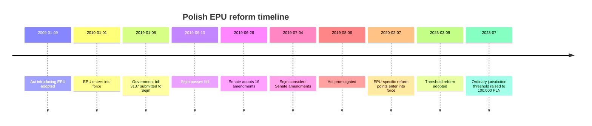
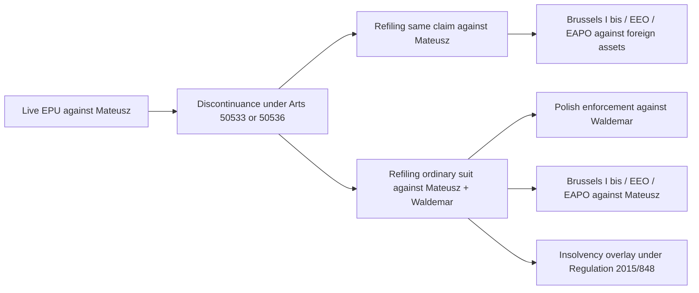

# Deep Research Report on the Polish EPU Amendment and the Proposed Co-Defendant Amendment

## Executive summary

The central correction is procedural and decisive: the tactic assumed in the second prompt is built largely on the **pre-2020 EPU model**, under which a case that ceased to fit electronic order-for-payment procedure could be **transferred** to the ordinary court. That is no longer the governing regime. Since the 2019 reform that took effect for the EPU provisions on **7 February 2020**, Articles 505^33 and 505^36 were rewritten so that the e-court **discontinues** the EPU instead of transferring it when there is no basis to issue an order or when an objection is filed. The amendment’s practical core is the replacement of the old formula **“przekazuje sprawę do sądu według właściwości ogólnej”** with **“umarza postępowanie.”** citeturn22view1turn17view3turn15view0turn45view0

That change materially alters the answer to the “add Waldemar inside EPU” question. A motion seeking to add a new co-defendant is **not expressly prohibited** by the current EPU chapter, because Article 505^29 excludes only specified provisions and does **not** list Articles 194–198 among the excluded rules. But trying to use that motion as a way to **migrate** a case out of EPU is no longer reliable, because the statute now points to **discontinuance, not transfer**. The only clear carry-over rule is Article 505^37 § 2, which preserves the effects of the original EPU filing if, within three months after discontinuance, the claimant refiles the **same claim**; the Ministry of Justice’s 2024 opinion paraphrases this logic as later litigation **between the same parties** over the same claim. That makes preservation of the April 2026 filing date relatively secure for a refiled claim against the **existing EPU defendant**, but much weaker for a **newly added co-defendant**. citeturn51search5turn24view3turn46view1turn36view1

The current law also matters because EPU cannot issue an order if service on the defendant would have to occur **outside Poland**. For a case with a Dutch-resident debtor and a proposed second defendant in Kraków, the legally safer architecture is an **ordinary Polish action** against both defendants, with later use of EU instruments for service, recognition, enforcement, and insolvency coordination. The relevant EU layer is therefore not an EU “EPU amendment” dossier—none exists for this Polish procedural reform—but the adjacent regulations on **service of documents**, **recognition and enforcement**, **European Account Preservation Orders**, **European Enforcement Orders**, and **cross-border insolvency**, plus Article 47 of the Charter and Article 6 ECHR. citeturn51search5turn51search7turn41search0turn41search1turn41search2turn41search3turn49search1turn52search0turn42search1turn42search10

In practical terms, the report’s bottom line is this: **do not treat an amendment inside the live EPU as the main route to obtain a single two-defendant judgment**. Under current law it is at best an uncertain pleading route and at worst a way to terminate the EPU without obtaining the old transfer effects the second prompt assumes. The sounder strategy is to treat the live EPU as, at most, a separate pressure path against Mateusz alone, while building any serious two-defendant case in the ordinary court. citeturn17view3turn24view3turn46view1turn51search10

## Scope and methodological correction

The legal object here is **not** an EU legislative amendment. It is a **Polish national procedural reform** of the Electronic Order-for-Payment Procedure under the Polish Code of Civil Procedure, introduced nationally and published through Poland’s official legislative system. The official legislative chain is Polish: the 2019 amending statute, Sejm print 3137, Senate proceedings, and the consolidated KPC text. The ELI page for the 2019 act identifies the issuing authority as the **Sejm**, not an EU institution. citeturn15view0turn21view0turn32view0

That matters because several requested items are only partly applicable. There are **no EU Member State positions or Council voting records for the Polish EPU amendment itself**, because the amendment was adopted inside Poland’s own legislative process. What **is** available—and what matters for the cross-border and rights analysis—is a set of official EU sources on service, enforcement, insolvency, and fundamental rights. citeturn15view0turn32view0turn41search0turn41search1turn41search2turn41search3turn52search0turn42search1

| Requested item | Applicability to this issue | Result |
|---|---|---|
| Exact amendment text | Fully applicable | Available in the 2019 amending act and current consolidated KPC. citeturn17view3turn51search5 |
| Legislative history and timeline | Fully applicable | Polish legislative history: government bill, Sejm adoption, Senate amendments, promulgation, delayed EPU entry into force. citeturn21view0turn31search4turn32view0turn15view0 |
| Member State positions and voting records | Not applicable to the Polish amendment itself | No EU Member State voting record exists for this national reform. Polish Sejm/Senate records are the relevant substitute. citeturn15view0turn32view0turn31search4 |
| Official EU sources | Applicable only as surrounding law | EUR-Lex texts matter for service, enforcement, EAPO, EEO, EOP, insolvency, and Charter review. citeturn41search0turn41search1turn41search2turn41search3turn49search1turn52search0turn42search1 |
| National implementing measures | Fully applicable | 2009 introduction of EPU, 2019 overhaul, court-cost rules, 2023 jurisdictional threshold change, and official EPU portal practice. citeturn46view1turn17view3turn36view1turn39search5turn8view0 |

The first attached document was read only as background context on the underlying joint-liability theories. The present report is limited to the **EPU procedural question** and its interaction with joint liability, cross-border enforcement, insolvency, and private-contract framing.

## Exact amendment text and legislative history

### The exact operative change

The decisive text is short. Before the reform, the EPU chapter used the transfer formula **“przekazuje sprawę do sądu według właściwości ogólnej.”** After the reform, Articles 505^33 and 505^36 use the discontinuance formula **“umarza postępowanie.”** In other words, the procedural bridge from EPU to ordinary proceedings was deliberately cut. citeturn22view1turn17view3

The current consolidated KPC also confirms two adjoining rules that are crucial for the present fact pattern. First, Article 505^28 § 2 states that an order cannot be issued if service would occur **“poza granicami kraju.”** Second, Article 505^37 § 2 preserves the effects of the original EPU filing if the claimant refiles the same claim within three months after discontinuance. Third, Article 19(2)(2) of the court-costs act credits the quarter EPU fee against the refiled suit in the Article 505^37 § 2 situation. citeturn51search5turn24view3turn36view1

### Why the legislature changed the model

The 2019 government justification explained that keeping EPU tied to ordinary proceedings created practical difficulties because EPU and the ordinary process differed sharply in **form, content, attachments, and purpose**. The drafters therefore wanted EPU to become a **short-life, special-purpose procedure** that usually ends either with a final order for payment or with discontinuance. Later academic discussion accurately captured the intended model: EPU should ordinarily end with **uprawomocnienie nakazu** or **umorzenie postępowania**, not transfer. citeturn23view0turn24view2turn45view0

That rationale also fits the institutional criticism that had built up before the reform. The Polish Ombudsman had warned that the old model could be used to file weak or “test” claims cheaply in EPU, pressure defendants into objecting, and then abandon or manipulate the follow-on litigation. The 2019/2020 redesign responded to that abuse pattern by making EPU a more self-contained filter. citeturn47view0turn45view0turn46view1

### Legislative timeline and voting record

The documentary trail is relatively clear. The government submitted print **3137** to the Sejm on **8 January 2019**, together with an EU-law compliance opinion. The Sejm passed the bill on **13 June 2019**; the search result from the Sejm API reports a final vote of **253 in favor, 172 against, 6 abstentions** at sitting 82, vote 24. The Senate then introduced **16 amendments** on **26 June 2019**. The act was promulgated on **6 August 2019**, but the EPU-specific points did not take effect until **7 February 2020**. citeturn21view0turn31search4turn32view0turn15view0

The 2023 jurisdictional reform is not part of the EPU amendment itself, but it matters tactically because it raised the district-court threshold to **100,000 PLN**. For an ordinary action worth **155,000 PLN**, the present forum outside EPU is therefore the **Sąd Okręgowy**, not the rejonowy court. citeturn39search5turn39search11

## Current legal effects on joint liability, amendment, fees, and cross-border reach

### What the current EPU chapter does and does not allow

Article 505^28 makes EPU available only for **monetary claims**, and it forbids issuing an EPU order where service would occur **outside Poland**. Article 505^29 excludes some procedural provisions, but it does **not** exclude Articles 194–198, which means the Code does not erect an express textual ban on asking to change the defendant-side configuration. At the same time, the official EPU portal warns that the plaintiff files EPU pleadings only through the dedicated electronic system, and that ePUAP or ordinary email do **not** produce legal effect in EPU. citeturn51search5turn8view0turn51search7

The practical consequence is subtle but important. A motion to add a co-defendant is not obviously a nullity under the statute. But the **benefit** the claimant might hope to get from such a motion—namely, using it as a device to trigger migration into ordinary proceedings while preserving the original EPU filing architecture—no longer follows from the statute. Since February 2020, loss of EPU suitability points to **discontinuance**, not transfer. That means the motion is, at best, an uncertain procedural request filed through the portal and, at worst, a way of pushing the e-court toward a discontinuance order. citeturn17view3turn24view3turn51search5

I did **not** find an official public source that confirms a dedicated FrontOffice workflow for “adding a second defendant” in a live EPU case. The official portal materials I retrieved are clear about exclusive electronic filing, but they do not publicly document a specific UI path or data schema for a mid-case subjective amendment. That is a real practical gap, and for practitioners it means a live portal check by counsel is still required before committing to this route. citeturn8view0turn9search2

### Why the current law makes EPU a weak vehicle for an added co-defendant

Even setting the UI question aside, a two-defendant case built on **joint tort** or **de facto partnership** is structurally far less EPU-friendly than a one-defendant, straight monetary collection claim. The 2019 justification and the post-reform commentary both emphasize that EPU was redesigned to be a **short, self-contained** route for straightforward cases, not a staging ground for evidence-heavy multiparty liability. That does not make multiparty pleading logically impossible, but it does make it a poor fit for the present route. citeturn23view0turn45view0turn45view2

That mismatch is intensified here by the foreign-service problem. If the court treats the real service position as service to a Dutch resident, Article 505^28 § 2(2) blocks issuance of the EPU order in the first place. The official EU e-Justice page on Poland and recent practitioner commentary both describe this as a current structural limit of EPU. In a case where one defendant is abroad and the other is domestic, the ordinary court is simply the more stable procedural home. citeturn51search5turn51search7turn51search10

### Effects on filing date, limitation, lis pendens, and costs

The post-2020 model compensates claimants only in a **limited** way. Article 505^37 § 2 provides a three-month window after discontinuance within which a refiled suit preserves the effects associated with the original EPU filing. The Ministry of Justice’s 2024 opinion is especially revealing because it glosses that mechanism as later litigation **“between the same parties”** and concerning the same claim. That reading strongly supports the conclusion that the preserved filing date is secure for a refiled ordinary claim against **Mateusz**, but is not securely extended to a **new** co-defendant such as Waldemar. At most, a later ordinary suit against both defendants would likely preserve the earlier filing effect **only as to the original EPU defendant**, while Waldemar would enter the litigation only on the date of the new ordinary filing. That last sentence is an inference, but it is the most textually defensible inference from the statute and the Ministry’s reading. citeturn24view3turn46view1turn36view1

On fees, the old “pay the differential after transfer” model no longer describes current law. Article 19(2)(2) of the court-costs act says that in the Article 505^37 § 2 scenario the EPU fee is **credited** against the newly filed suit. That is not the same thing as automatic in-case supplementation after transfer, because there is no transfer. The practical implication is that a claimant now faces a **new filing**, not a continuation in another court file. citeturn36view1turn24view3

If the claimant instead **withdraws** the EPU before service, the general refund rules in Article 79 become relevant, and they are not as generous as many litigants assume. Article 79 provides for refund of the court fee in specified early-withdrawal situations, but Article 79(3) reduces the returned amount by the equivalent of the minimum fee. The sources retrieved do not fully resolve the interaction between that refund logic and the later Article 19(2)(2) credit mechanism if the claimant both withdraws and promptly refiles. The safest assumption for planning purposes is that the claimant should expect **either a credit or a refund, not a double benefit**. citeturn37view0turn36view1

### Effects on joint liability and private-contract framing

Procedurally adding Waldemar would **not** itself create substantive liability. If the contractual counterparty on the invoice and payment trail is Mateusz alone, then a direct contract claim against Waldemar needs a legal bridge of its own—most obviously a partnership theory, a representation/holding-out theory, or a tort-participation theory. The procedural lesson of the EPU amendment is therefore negative rather than positive: it does not solve the underlying liability problem; it merely determines whether the claimant can litigate that problem in EPU or must do so in the ordinary court.

That matters because the more substantively ambitious the case against Waldemar becomes, the less attractive EPU looks. A one-defendant monetary payment claim can fit EPU. A two-defendant claim that asks the court to decide whether public co-branding, shared communications, negotiation conduct, and debt-refund correspondence create joint and several liability is much more naturally an **ordinary evidentiary case**. The 2019/2020 reform reinforces that conclusion by cutting off the old transfer bridge. citeturn45view0turn45view2turn51search10

### Effects on cross-border enforcement and insolvency

For service and enforcement against a Dutch-resident debtor, the key EU source is **Regulation (EU) 2020/1784** on service of judicial documents in civil and commercial matters. For later recognition and enforcement of a Polish judgment in another Member State, the key source is **Brussels I bis**, Regulation (EU) No 1215/2012. If the claim ends in an uncontested judgment satisfying the relevant conditions, an additional route may exist through the **European Enforcement Order** under Regulation (EC) No 805/2004. If urgent preservation of accounts in another Member State becomes important, the relevant official instrument is the **European Account Preservation Order** under Regulation (EU) No 655/2014. And if the claimant wants a distinct EU uncontested-claims route, the **European Order for Payment** under Regulation (EC) No 1896/2006 remains conceptually separate from Polish EPU. citeturn41search0turn41search1turn41search2turn41search3turn49search1

In insolvency, the relevant cross-border framework is Regulation (EU) 2015/848. That Regulation determines jurisdiction, recognition, and the law applicable to main insolvency proceedings across the EU. In practice, this means that if either debtor enters insolvency before or after judgment, the value of having two defendants rises: the ordinary action can still matter as to the solvent co-debtor even if one enforcement track becomes subordinated to insolvency rules. citeturn52search0turn52search3

The net enforcement picture is therefore straightforward. A one-defendant EPU case against a foreign-resident debtor is procedurally fragile and enforcement-limited. A two-defendant ordinary action creates a more robust enforcement map: domestic enforcement against Waldemar in Poland, and cross-border enforcement tools against Mateusz if necessary. citeturn51search5turn41search1turn41search2turn52search0

## EU primary law, ECHR, and the official EU layer

### Official EU sources and why they matter here

For the Polish EPU reform itself, there is no Commission proposal, Parliament report, Council common position, or Member State voting map to reconstruct, because the measure is **Polish domestic law**. But the case does engage official EU law in at least five ways: service to a defendant abroad, recognition and enforcement of Polish judgments in another Member State, preservation of bank accounts, treatment of uncontested claims, and cross-border insolvency. The official EU sources reviewed for those issues were the EUR-Lex texts for Regulations **2020/1784**, **1215/2012**, **655/2014**, **805/2004**, **1896/2006**, **2015/848**, and Article **47** of the Charter. citeturn41search0turn41search1turn41search2turn41search3turn49search1turn52search0turn42search1

The national reform also passed an EU-law check inside the Polish legislative file. The government bill contained a formal opinion that the proposed Polish reform was **not contrary to EU law**. That is not the same thing as saying every future application of the provisions will be EU-law compliant, but it does matter as part of the legislative history. citeturn21view0

### Compliance assessment under the Charter and the ECHR

On the current materials, the post-2020 EPU model is **likely compatible** with Article 47 of the Charter and Article 6 ECHR. The strongest compatibility argument is that EPU remains an **optional, simplified entry route**, not the only path to court, and Article 505^37 § 2 cushions the loss of the EPU track by preserving the filing effects of the original claim in a later ordinary action. That makes the reform look proportionate rather than access-denying. citeturn42search1turn42search10turn24view3

There is also a defendant-protection argument in favor of compliance. The reform responded to real complaints about abuse of the old EPU model in mass-claim practice. The Ombudsman’s 2017 intervention described concerns about low-cost speculative filings and asymmetry between claimant and defendant. The Ministry’s 2024 opinion continues the same line of thought by defending the simplified EPU cost regime and emphasizing that EPU should remain as simple and quick as possible. Read together, those sources make the discontinuance model look like a rights-balancing measure rather than an arbitrary barrier. citeturn47view0turn46view1

The more serious constitutional and Convention risk lies at the **margins**. If courts or portal practice were to interpret the refiling mechanism in a rigid way that deprived a claimant of any meaningful chance to preserve filing effects, or if domestic-address formalities were used in a manner that deprived an abroad-based defendant of real notice, pressure under Article 47 and Article 6 would increase. The ECtHR has repeatedly treated **excessive formalism** as incompatible with the practical and effective right of access to a court, and that principle furnishes the best human-rights lens for any future challenge to a harsh application of the EPU discontinuance rules. citeturn42search21turn42search12turn42search10

The most defensible bottom-line rights view is therefore mixed. The statute **as designed** is probably compatible with EU primary law and the ECHR. The most plausible future challenges would be **application-level challenges**—especially around notice, rigid identity-of-parties rules, or portal-only filing formalism—not a facial challenge to the 2019/2020 reform itself. citeturn42search1turn42search10turn47view0turn46view1

## Comparison of interpretations across official, academic, and practitioner sources

The current source landscape is unusually coherent on one point: **post-2020 EPU is not a transfer gateway anymore**. The disagreement is not about that; it is about whether the current cost and fairness balance is good policy.

| Source | Type | Core interpretation | Implication for adding Waldemar |
|---|---|---|---|
| Current consolidated KPC text citeturn51search5turn17view3turn24view3 | Official statute | No order if service would be abroad; no transfer after no-order or objection; limited refiling protection after discontinuance | Amendment inside EPU does not reliably migrate the case; preservation is strongest only for same claim against original defendant |
| 2019 amending act and ELI remarks citeturn15view0turn17view3 | Official legislative text | Arts. 505^33–505^38 were deliberately rewritten; EPU points entered into force on 7 Feb 2020 | Any strategy still assuming pre-2020 transfer is outdated |
| Government justification to print 3137 citeturn23view0turn24view2 | Official legislative history | Old linkage to ordinary proceedings caused practical trouble because EPU and ordinary litigation have different structure and purpose | Multiparty, evidence-heavy liability theories belong in ordinary proceedings |
| Ministry of Justice opinion to Senate petition, 24 Jan 2024 citeturn46view1 | Official executive interpretation | EPU cost simplification is intentional; later same-claim litigation between the same parties can account for EPU costs | Relation-back logic does not comfortably extend to a fresh co-defendant |
| Senate petition materials, 2023–2024 citeturn46view2turn44search10 | Official parliamentary materials | Current EPU rules are still controversial, especially as to defendants’ objection costs | Costs and fairness remain live policy questions, but the statutory model itself is unchanged |
| Polish Ombudsman intervention, 2017 citeturn47view0 | Official rights-based criticism | The old model enabled cheap speculative filings and asymmetry in mass claims | The reform’s anti-abuse logic makes courts less likely to stretch EPU for complex joined claims |
| Cezary Dzierzbicki, 2022 citeturn45view0 | Academic article | EPU should, as a rule, end with a final order or discontinuance; transfer should be exceptional | Strong academic support for treating current EPU as self-contained, not as prelude to ordinary litigation |
| Berenika Kaczmarek-Templin, reform commentary citeturn45view2 | Academic commentary | The reform “breaks the link” between EPU and the subsequent ordinary process | Adding a co-defendant belongs to the separate ordinary suit, not to EPU engineering |
| Jakub Kutyła, practical note on the 2020 reform citeturn51search10 | Practitioner note | Since 7 Feb 2020, service abroad blocks EPU orders and the new model is discontinuance-based | Foreign-residence facts make EPU an unstable vehicle for a joined two-defendant strategy |
| EU e-Justice Poland page citeturn51search7 | Official EU-country guidance | EPU is online-only, for monetary claims, and unavailable where the order would have to be served abroad | Confirms that a Dutch-resident defendant is structurally problematic for EPU |

The comparative picture is not close. Every relevant **post-2020** source—official, academic, and practical—points in the same direction: the old transfer assumptions should be discarded, and any serious co-defendant strategy should be planned as an **ordinary suit architecture**, not as an EPU modification trick. citeturn17view3turn45view0turn45view2turn51search10turn51search7

## Practical implications, legal strategy, and next research steps

### Business and practitioner implications

For businesses and litigators, the practical lesson is that Polish EPU is now a **front-end filter**, not a procedural escalator. If the case is likely to require party-structure changes, service abroad, factual reconstruction, or nontrivial liability theories, EPU no longer saves much except the possibility of a quick uncontested order. Its failure mode is discontinuance and refiling, not seamless continuation in another court. citeturn17view3turn24view3turn51search7

That has a direct drafting consequence for private contracts and online sales operations. If commercial communication, branding, negotiation, and refund handling blur the lines between separate sole proprietors, the procedural problem later becomes expensive: the claimant may be forced into an ordinary suit to decide who is actually liable. The EPU amendment did not change substantive private-contract doctrine, but it made **entity discipline** more important by reducing the usefulness of EPU as a fallback path when liability later turns out to be multiparty.

### Strategy matrix

| Strategy | Filing-date protection | Court-fee position | Enforcement upside | Main weakness | Overall assessment |
|---|---|---|---|---|---|
| Try to add Waldemar inside the live EPU | Unclear at best; not securely preserved for Waldemar | No old-style differential-after-transfer model anymore | Could prompt procedural clarification | Uncertain UI, uncertain doctrinal payoff, likely discontinuance rather than migration | **Not recommended as the main route** citeturn8view0turn17view3turn24view3 |
| Keep EPU against Mateusz and file ordinary suit separately against Waldemar | Preserves whatever leverage the existing EPU still has; ordinary suit date runs separately for Waldemar | EPU fee remains where it is; ordinary suit needs full ordinary fee | Two parallel enforcement tracks; no need to sacrifice current EPU | Split litigation, duplicate cost, inconsistent timing | **Good if immediate pressure against Mateusz matters** citeturn51search5turn41search1turn39search5 |
| Withdraw or await discontinuance, then file one ordinary suit against both | Strongest case for preserving date only as to Mateusz and same claim; weaker for Waldemar | Refiled ordinary suit uses current cost rules; EPU fee should be treated as refundable or creditable, but not doubly recoverable | Single judgment, coherent liability pleading, best platform for joined evidence | Loses the illusion of EPU continuity; added-defendant timing benefit remains uncertain | **Best if a single two-defendant judgment is the real objective** citeturn24view3turn36view1turn37view0turn39search5 |

### Recommendations

The strongest legal recommendation is to **stop treating the live EPU as a bridge into ordinary proceedings**. On the law now in force, that bridge no longer exists in the form assumed by the second prompt. citeturn22view1turn17view3

The strongest procedural recommendation is to choose between two coherent architectures, not three half-ones. If the claimant still values the chance—however fragile—of a quick uncontested order against Mateusz, keep the live EPU as a **separate pressure track** and file the serious two-defendant case in the ordinary court. If, instead, the real goal is one enforceable judgment against both Mateusz and Waldemar, then move to an **ordinary two-defendant action** and assume that any preserved filing effects are safest only as to Mateusz. citeturn51search5turn24view3turn46view1turn39search5

The strongest “next research” items are practical, not conceptual. The key unresolved points are **portal mechanics** and **the exact service position** of the foreign-resident defendant. Those should be tested immediately by a Polish pełnomocnik with access to the live file and portal, because the public sources do not conclusively document the amendment workflow and because EPU’s service-abroad bar may already make the current file structurally unstable. citeturn8view0turn51search5turn51search7

### Bottom line

At today’s legal state, the recommended move is **not** to rely on an amendment inside the live EPU as the route to add Waldemar, because the current law no longer gives that amendment the procedural consequence the second prompt assumes: the likely statutory consequence is **discontinuance**, not transfer, and the preserved filing date is securely grounded only for a later same-claim suit against the original EPU defendant. The next step in the near term is to have counsel verify the live EPU file and portal mechanics, then decide between **parallel ordinary litigation against Waldemar while preserving EPU leverage against Mateusz**, or a **single ordinary suit against both defendants** if one judgment is the true commercial objective. citeturn17view3turn24view3turn46view1turn8view0turn39search5